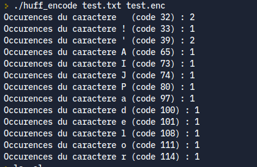
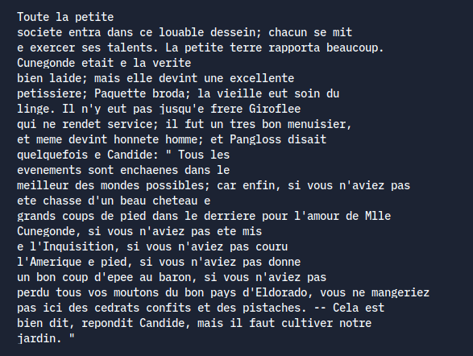

# Présentation et Objectifs du TP

Les objectifs du TP sont:

1. Concevoir un programme en C permettant de coder un fichier texte donné à l'aide de l'algorithme de Huffman, puis d'écrire le résultat dans un autre fichier.

2. Concevoir un autre programme en C permettant de décoder le fichier précedemment encodé.

# Mise en place des expériences

On a d'abord implémenté l'algorithme de compression, avec les différentes étapes (compte des occurences, construction de l'arbre, création du code, et écriture du fichier). Ensuite, on a implémenté l'algorithme de décompression qui lit un arbre de Huffman et s'en sert pour décoder le fichier.

On a utilisé les fichiers `candide.txt` et `gargantua.txt` pour tester nos implémentations, ce qui nous a permis de découvrir certains bugs, notamment dans la façon dont nous créions notre arbre de Huffman.

Les modules fournis ont été utilisés de la façon suivante :

- `arbrebin` : lecture et écriture de l'arbre de Huffman. Les feuilles représentent des symboles. Les noeuds ne portent aucune information. On a également utilisé ce module pour écrire et les des arbres dans un fichier facilement ;
- `bfile` : pour écrire bit à bit notre code, ce qui permet d'être plus compact que de l'ASCII ;
- `fap` : pour construire l'arbre en prenant toujours les lettres les moins présentes en premier, afin qu'elles soient le plus profond dans l'arbre et donc qu'elles aient des codes plus longs que les lettres souvent utilisées.

# Présentation des résultats

Tout d'abord, avant de tester nos algorithmes sur les fichiers contenant Candide et Gargantua, nous avons crée un fichier test plus petit, ne contenant que la ligne "J'adore l'API !".

Sur la capture ci-dessus, vous pouvez voir le nombre d'occurences pour chaque caractère contenu dans le fichier, et constater qu'ils sont conformes à son contenu. Comme prévu, lancer la commande `./huff_encode test.txt test.enc` crée un fichier .enc contenant le texte du premier fichier passé en argument, codé à l'aide de l'algorithme de Huffman.

Il nous a aussi été demandé de pouvoir décoder le code ainsi crée, à l'aide de la fonction `Decoder` contenue dans le fichier huff_decode.c. Après vérification, nous constatons que la fonction Decoder nous renvoie, comme nous le souhaitions, le texte contenu dans le fichier test.txt. 

Les fonctions contenues dans les deux fichiers évoqués précédemment fonctionnent aussi sur des fichiers plus volumineux, comme nous avons pu l'observer avec le fichier candide.txt, contenant l'intégralité de l'oeuvre du même nom. Vous trouverez ci-dessous une capture d'écran d'un paragraphe du fichier `candide.enc` après décodage. Nous avons remplacé les caractères avec accent par des e, car ceux-ci ne s'affichaient pas correctement, même dans le fichier de base.

La compression du fichier texte initial semble assez efficace. Sur le fichier `gargantua.txt` on passe de `270 579` octets à `158 690` après compression, soit 58% de la taille du fichier initial. Pour `candide.txt`, on passe de `201 404` octets à `115 425` après compression, soit 57% de la taille du fichier initial.

# Conclusion

Nous pouvons donc en conclure, au vu des résultats donnés par les différents tests effectués, que les fonctions permettant de coder et de décoder un fichier texte donné sont toutes opérationnelles. Le codage de Huffman
utilisé permet de réduire, presque de moitié, la taille du fichier encodé. La fonction Decoder permet, comme nous le souhaitions, de récupérer le texte original.
